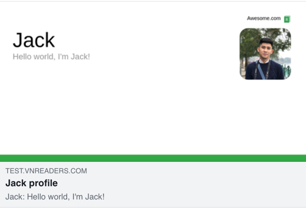

# Run
### Build docker image
```shell
docker build -t dynamic-thumbnail-service .
```

### Run docker container
```shell
docker run -d -e PORT=3000 -p 3001:3000 dynamic-thumbnail-service:latest
```

Now service is live on `http://localhost:3001`

Try it out: `http://localhost:3001/users/thumbnail/:userId.png`

Change `userId` to `jack, tony, peter, ...` or any other name, you will get a corresponding image. This is how `dynamic thumbnail` works! 


# Update website
Update the following meta tag in your website:
```html
<meta property="og:image" content="http://dynamic-thumbnail-service/users/thumbnail/foo.png">
```

Now, when user share this page to Twitter, Facebook, or Slack chat,... they can see a thumbnail with their name instead of a fixed image for all.

You can use [Facebook debug tool](https://developers.facebook.com/tools/debug) to preview:


# Troubleshooting puppeteer problems
https://github.com/puppeteer/puppeteer/blob/main/docs/troubleshooting.md